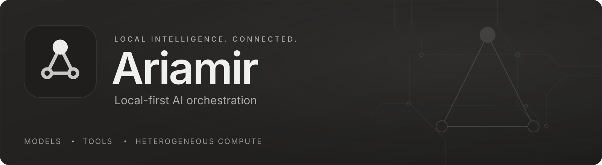
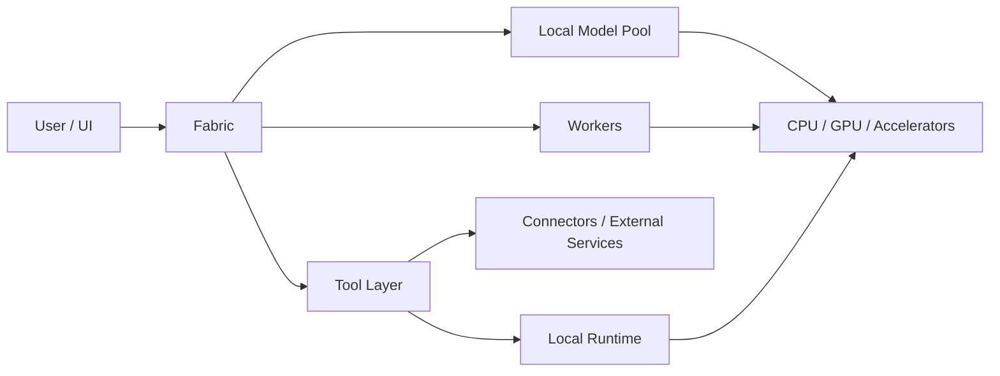

<h1>
  
</h1>

**Local-first AI orchestration, tool execution and heterogeneous compute — presented without exposing proprietary internals.**

> This repository is the public showcase for Ariamir. It demonstrates what the system can do, the environments it is being validated on, and the direction of the project. It is **not** the Ariamir source tree and does not publish the implementation of Fabric, private routing logic, system prompts, permission internals, private schemas, production configuration, credentials, datasets or proprietary worker code.

Ariamir is an AI systems project focused on coordinating local models, tools, workers and hardware resources through a unified operating layer. The project is designed around practical local execution, explicit permissions, reproducible workflows and the ability to combine CPU, GPU and other accelerators according to workload needs.

## Current capability snapshot

| Area | Public status |
| --- | --- |
| Fabric coordination layer | Implemented; actively evolving |
| Local model orchestration | Implemented |
| Worker-based task execution | Implemented |
| Tool runtime and permissioned actions | Implemented |
| Retrieval / RAG workflows | Implemented |
| Document Engine | Implemented; ongoing quality validation |
| Local image workflows | Available in development builds |
| Local video generation | Integration and validation stage |
| Enterprise environment | Research / architecture exploration |
| Hardware Compatibility Lab | Active |
| Heterogeneous / FPGA acceleration | Exploration and partner-validation stage |

Status labels intentionally describe capability at a high level. They are not a disclosure of internal architecture.

## Architecture overview



That diagram is intentionally the level of detail published here: **boxes, interfaces and outcomes — not proprietary orchestration internals.**

See [`docs/architecture-overview.md`](docs/architecture-overview.md) for the public architecture boundary.

## What Ariamir is being built to do

- Coordinate multiple local AI models instead of treating one model as the entire system.
- Delegate bounded work to workers with clear responsibilities.
- Expose tools through explicit permission and execution boundaries.
- Search, retrieve and work with local knowledge and documents.
- Produce and transform document outputs through a dedicated Document Engine.
- Integrate local media generation workflows, including image and video pipelines.
- Validate how AI workloads behave across real hardware configurations.
- Treat accelerators such as GPUs and FPGAs as heterogeneous resources for suitable workloads.

More detail: [`docs/capabilities.md`](docs/capabilities.md).

## Enterprise deployment exploration

Ariamir is also exploring a specialized deployment environment aimed at business and professional use cases, with a focus on controlled deployments, organizational security, permission governance, auditable workflows, integration with enterprise infrastructure, and scalable heterogeneous compute.

This work is at the research and architecture exploration stage. It does not represent an available Enterprise edition or validated enterprise security, compliance, scalability or multi-user capabilities.

## Hardware Compatibility Lab

Ariamir is developed and validated on real local hardware rather than only cloud abstractions. The current reference workstation includes:

- **CPU:** Intel Core i7-12700KF
- **GPU:** NVIDIA GeForce RTX 4080 16 GB
- **Memory:** 32 GB system RAM
- **Platform:** Windows x64

The lab tracks compatibility, throughput, VRAM/RAM pressure, latency, thermals where available, failure modes and workload suitability. Results are published only when the methodology and data are suitable for public release.

See [`docs/hardware-lab.md`](docs/hardware-lab.md) and [`benchmarks/`](benchmarks/).

## Example workflows

The following examples are **illustrative and fictitious**. They communicate product behavior without reproducing private prompts, routing rules or implementation details.

### Research and document workflow

```text
User request
  → Fabric
  → research worker + retrieval tools
  → source collection
  → document worker
  → reviewed report output
```

### Local media workflow

```text
User request
  → Fabric
  → media worker
  → local generation backend
  → post-processing tools
  → output artifact
```

### Heterogeneous compute workflow

```text
Workload
  → Fabric
  → suitable execution resource
  → CPU / GPU / accelerator
  → measured result
```

For FPGA-oriented evaluation, the public objective is straightforward: Ariamir can treat an FPGA as a heterogeneous resource for deterministic preprocessing, streaming, specialised kernels and low-latency pipelines, coordinated with CPU/GPU resources. The decision logic and implementation remain private.

## Public disclosure boundary

We publish:

- what Ariamir does;
- high-level system boundaries;
- sanitized screenshots and demos;
- reproducible benchmark methodology and approved results;
- hardware compatibility findings;
- roadmap and release notes;
- fictitious workflow examples;
- public partner acknowledgements when authorised.

We do **not** publish:

- Fabric source code or private routing heuristics;
- system prompts or private worker prompts;
- detailed permission logic;
- proprietary orchestration internals;
- private schemas or production configuration;
- credentials, tokens or secrets;
- private datasets or user data;
- source code whose publication would make the implementation reproducible.

Full policy: [`docs/public-disclosure-policy.md`](docs/public-disclosure-policy.md).

## Repository map

```text
ariamir-showcase/
├── README.md
├── CHANGELOG.md
├── CONTRIBUTING.md
├── SECURITY.md
├── LICENSE
├── docs/
│   ├── overview.md
│   ├── capabilities.md
│   ├── architecture-overview.md
│   ├── hardware-lab.md
│   ├── public-disclosure-policy.md
│   └── roadmap.md
├── media/
│   ├── screenshots/
│   ├── demos/
│   └── diagrams/
├── benchmarks/
│   ├── local-llm.md
│   ├── document-engine.md
│   └── hardware.md
└── partners/
    └── README.md
```

## Hardware vendors, sponsors and validation partners

Ariamir is open to hardware evaluation, compatibility testing and technical sponsorship where there is a concrete fit with local AI workloads. Relevant areas include compute, FPGA/accelerators, memory, storage, cooling, chassis/power, networking, capture and workstation peripherals.

A public acknowledgement is made only with permission. Supplying evaluation hardware does not automatically imply endorsement by either party.

See [`partners/README.md`](partners/README.md).

## Project status

Ariamir is under active development. Public documentation may lag private development builds, and intentionally omits implementation details that form part of the project's proprietary IP.

## License

The public materials in this showcase are **not an open-source release of Ariamir**. See [`LICENSE`](LICENSE).
