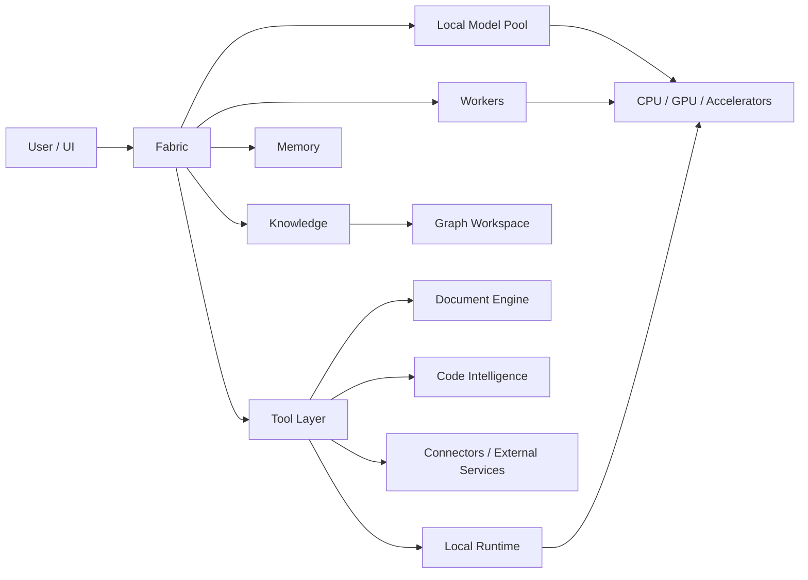

<h1>
  
</h1>

> **ACTIVE DEVELOPMENT — NOT A FINISHED PRODUCT.** Ariamir is still being built. Many functions require intensive QA, end-to-end validation, reliability work and usability polish. Describing a system here does not mean it is complete, stable or production-ready.

**Local-first AI orchestration, tool execution and heterogeneous compute — presented without exposing proprietary internals.**

> This repository is the public showcase for Ariamir. It demonstrates what the system can do, the environments it is being validated on, and the direction of the project. It is **not** the Ariamir source tree and does not publish the implementation of Fabric, private routing logic, system prompts, permission internals, private schemas, production configuration, credentials, datasets or proprietary worker code.

Ariamir is an AI systems project focused on coordinating local models, tools, workers and hardware resources through a unified operating layer. The project is designed around practical local execution, explicit permissions, reproducible workflows and the ability to combine CPU, GPU and other accelerators according to workload needs.

## Systems under active development

Ariamir brings together several systems, each with its own development and validation work. **Development / QA** means functionality exists in development builds and is still being tested and refined; it is not a release-readiness claim. Availability also depends on configuration, models, hardware and the specific workflow.

| System | What it is being built to do | Current stage |
| --- | --- | --- |
| Fabric and workers | Coordinate tasks, models, tools and bounded workers | Development / QA |
| Model runtime | Manage local models, context and CPU/GPU/memory resources | Development / QA |
| [Knowledge](docs/knowledge.md) | Organize project knowledge, notes, sources and relationships | Development / QA |
| Graph Workspace | Explore connected knowledge and optional task, code and Fabric views | Development / QA |
| Knowledge Learning | Prepare reviewable learning and maintenance proposals | Development / QA |
| Memory | Maintain conversational continuity and user preferences separately from project knowledge | Development / QA |
| Document Engine | Read, analyse and generate documents, with output quality checks | Development / intensive QA and polish |
| Code Intelligence | Explore code, understand changes and support verified edits | Development / QA |
| Tool Lab and modules | Manage optional capabilities, dependencies and their lifecycle | Development / integration and QA |
| Browser and desktop tools | Observe and perform supervised actions in supported environments | Development / coverage and QA |
| Bridge / MCP | Let compatible clients work with Ariamir's permitted capabilities | Development / integration and QA |
| Connectors and accounts | Integrate external services through configured accounts | Development / provider-dependent validation |
| Projects, tasks and artifacts | Organize work, track progress and manage generated files | Development / QA and usability polish |
| Local diagnostics | Inspect system health and support bounded, reviewable maintenance | Development / QA |
| Desktop and distribution | Deliver the app, installation, updates and recovery workflows | Development / packaging and QA |
| Local image and video | Support local media workflows | Images: development / QA; video: integration / validation |
| Hardware Compatibility Lab | Measure compatibility and behaviour on real components | Active testing; public results pending |
| Heterogeneous / FPGA acceleration | Explore suitable accelerator workloads | Exploration / partner validation |
| Enterprise environment | Explore controlled business and professional deployments | Research / architecture exploration |
| Android portability | Explore a mobile execution environment | Architecture / future work |

Full system descriptions: [capabilities](docs/capabilities.md). Development priorities: [roadmap](docs/roadmap.md).

## Architecture overview



That diagram is intentionally the level of detail published here: **boxes, interfaces and outcomes — not proprietary orchestration internals.**

See [`docs/architecture-overview.md`](docs/architecture-overview.md) for the public architecture boundary.

## Knowledge, Graph Workspace and learning

**Knowledge is a dedicated system within Ariamir.** It brings together editable project notes, sources, decisions and relationships, with search and retrieval that can supply relevant context to ongoing work.

Graph Workspace provides a visual way to explore those relationships. Development work includes filtering, inspecting sources, following connections and optional views of tasks, code and Fabric activity. Knowledge Learning prepares proposals from selected observations and reviewed outcomes so that knowledge can be improved deliberately.

Memory handles conversational continuity and preferences separately. A generated answer or a frequently retrieved note is not, by itself, proof that a claim is correct. These systems still need intensive QA, cross-system validation and interface polish.

See [Knowledge, Graph Workspace and learning](docs/knowledge.md) for the public overview.

## What Ariamir is being built to do

- Coordinate local models, workers and tools across practical workflows.
- Build and explore persistent project knowledge, including sources and relationships.
- Support conversational memory alongside reviewable knowledge learning.
- Read, analyse and produce documents, code and other useful artifacts.
- Carry out supervised browser, desktop and project operations.
- Extend capabilities through Tool Lab, modules, configured connectors and Bridge / MCP.
- Organize projects, tasks, generated files and recoverable work.
- Integrate local image and video workflows and evaluate real hardware behaviour.

These are product capabilities under development, not a promise that every workflow is complete or reliable. More detail: [capabilities](docs/capabilities.md).

## Enterprise deployment exploration

Ariamir is also exploring a specialized deployment environment aimed at business and professional use cases, with a focus on controlled deployments, organizational security, permission governance, auditable workflows, integration with enterprise infrastructure, and scalable heterogeneous compute.

This work is at the research and architecture exploration stage. It does not represent an available Enterprise edition or validated enterprise security, compliance, scalability or multi-user capabilities.

## Hardware Compatibility Lab

Ariamir is developed and validated on real local hardware rather than only cloud abstractions. The current reference workstation includes:

- **CPU:** Intel Core i7-12700KF
- **GPU:** NVIDIA GeForce RTX 4080 16 GB
- **Memory:** 32 GB system RAM
- **Platform:** Windows x64

The lab tracks compatibility, throughput, VRAM/RAM pressure, latency, thermals where available, failure modes and workload suitability. Results are published only when the methodology and data are suitable for public release.

See [`docs/hardware-lab.md`](docs/hardware-lab.md) and [`benchmarks/`](benchmarks/).

## Example workflows

The following examples are **illustrative and fictitious**. They communicate product behavior without reproducing private prompts, routing rules or implementation details.

### Knowledge-assisted project workflow

```text
Question about a project
  → relevant Knowledge notes and sources
  → relationship inspection in Graph Workspace, when useful
  → answer or document with source references
  → proposed knowledge update for review, if appropriate
```

This illustrates intended user-facing behaviour. It does not imply that every path has completed end-to-end validation.

### Research and document workflow

```text
User request
  → Fabric
  → research worker + retrieval tools
  → source collection
  → document worker
  → reviewed report output
```

### Local media workflow

```text
User request
  → Fabric
  → media worker
  → local generation backend
  → post-processing tools
  → output artifact
```

### Heterogeneous compute workflow

```text
Workload
  → Fabric
  → suitable execution resource
  → CPU / GPU / accelerator
  → measured result
```

For FPGA-oriented evaluation, the public objective is straightforward: Ariamir can treat an FPGA as a heterogeneous resource for deterministic preprocessing, streaming, specialised kernels and low-latency pipelines, coordinated with CPU/GPU resources. The decision logic and implementation remain private.

## Public disclosure boundary

We publish:

- what Ariamir does;
- high-level system boundaries;
- sanitized screenshots and demos;
- reproducible benchmark methodology and approved results;
- hardware compatibility findings;
- roadmap and release notes;
- fictitious workflow examples;
- public partner acknowledgements when authorised.

We do **not** publish:

- Fabric source code or private routing heuristics;
- system prompts or private worker prompts;
- detailed permission logic;
- proprietary orchestration internals;
- private schemas or production configuration;
- credentials, tokens or secrets;
- private datasets or user data;
- source code whose publication would make the implementation reproducible.

Full policy: [`docs/public-disclosure-policy.md`](docs/public-disclosure-policy.md).

## Repository map

```text
ariamir-showcase/
├── README.md
├── CHANGELOG.md
├── CONTRIBUTING.md
├── SECURITY.md
├── LICENSE
├── docs/
│   ├── overview.md
│   ├── capabilities.md
│   ├── knowledge.md
│   ├── architecture-overview.md
│   ├── hardware-lab.md
│   ├── public-disclosure-policy.md
│   └── roadmap.md
├── media/
│   ├── screenshots/
│   ├── demos/
│   └── diagrams/
├── benchmarks/
│   ├── local-llm.md
│   ├── document-engine.md
│   └── hardware.md
└── partners/
    └── README.md
```

## Hardware vendors, sponsors and validation partners

Ariamir is open to hardware evaluation, compatibility testing and technical sponsorship where there is a concrete fit with local AI workloads. Relevant areas include compute, FPGA/accelerators, memory, storage, cooling, chassis/power, networking, capture and workstation peripherals.

A public acknowledgement is made only with permission. Supplying evaluation hardware does not automatically imply endorsement by either party.

See [`partners/README.md`](partners/README.md).

## Project status

Ariamir is unfinished and under active development. Many functions still need intensive QA, regression testing, end-to-end validation, reliability improvements and usability polish. Individual features or passing tests do not establish whole-product readiness.

Public documentation may lag development builds. Benchmark methodology is not a measured result, and a listed capability is not a guarantee of availability or production suitability. Proprietary implementation details remain private.

## License

The public materials in this showcase are **not an open-source release of Ariamir**. See [`LICENSE`](LICENSE).
