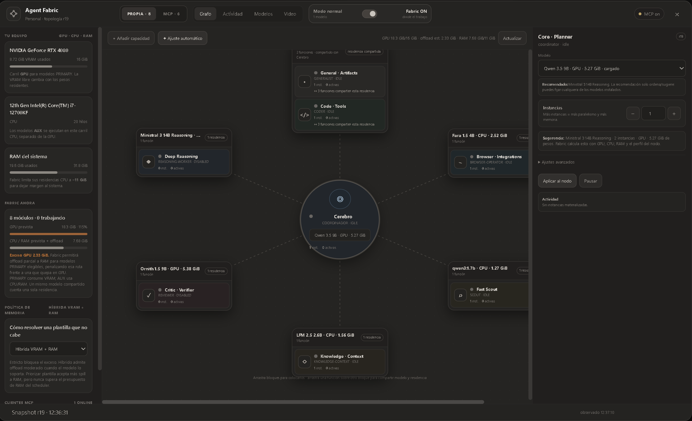
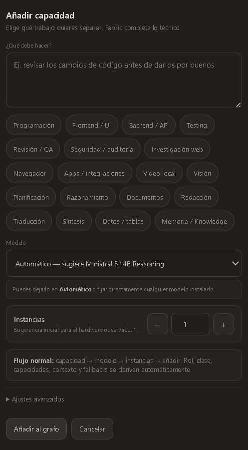

<h1>
  
</h1>

**Local-first AI for knowledge, useful work and extensible capabilities.**

Ariamir brings models, project knowledge, documents and supervised tools into one workspace. It is built for people who want to work with their own information, review consequential actions and choose the capabilities their work needs.

> **0.19 development line · Modular transformation underway · M7 in progress**
>
> Reviewed 5 October 2026. Ariamir is an unfinished product. Implemented features, technical validation and a stable public release are different states.

[Current status](docs/current-status.md) · [Capabilities](docs/capabilities.md) · [Knowledge](docs/knowledge.md) · [Roadmap](docs/roadmap.md) · [Hardware Lab](docs/hardware-lab.md) · [Collaborate](partners/README.md)

## What is changing in 0.19

**Ariamir is evolving into a more extensible platform.** The 0.19 line adds business modules with their own views and project data, controlled access, integrations and a managed lifecycle. The ongoing transformation builds on that foundation so capabilities can be developed, tested and maintained more consistently.

For users, the direction is practical: add a capability for a particular job, keep its data under control and make updates and recovery easier to assess. For developers, it is a clearer path to building extensions without depending on proprietary internals.

| Status | What it means today |
| --- | --- |
| **Implemented in development builds** | Business-module installation and updates, project data and access controls, backup/retirement options, assistant proposals, Knowledge and supervised tools. Availability depends on the build and configuration. |
| **In progress — M7** | Validation of a representative capability through the new development path. Foundational runtime and SDK work has implementation and test evidence, but validation remains open. M7 is not complete. |
| **Roadmap / exploration** | Broader migration of capabilities, real deployment evidence, public performance results and future platform/hardware support. |

The latest records include an incomplete M7 attempt and reopened validation in its prerequisites. We therefore report the transformation as **in progress**, without presenting an earlier technical pass as final acceptance. [Read the dated status](docs/current-status.md).

## What you can do with Ariamir

These capabilities exist in development builds. The table describes their purpose and the work still needed, rather than promising universal availability.

| Area | Practical value | Current boundary |
| --- | --- | --- |
| **Knowledge and Graph Workspace** | Find project notes and sources, follow relationships and inspect supporting context. | Retrieval, scale, synchronization and accessibility remain under validation. |
| **Documents and code** | Read source material, prepare reports, explore code and review changes. | Output accuracy, layout and complete workflows still need QA. |
| **Assistant proposals** | Review a suggested next step before deciding what to do. | Accepting a proposal creates a plan; execution requires separate authorization. |
| **Business modules** | Add focused tools with their own workspace views and project data. | Implemented in 0.19 candidates; the platform transformation and real-module acceptance continue. |
| **Models and Fabric** | Coordinate models, tools and available compute for a task. | Capacity depends on hardware and workload; cloud inference is optional and explicitly selected. |
| **Browser, desktop and integrations** | Work through supported tools, configured services and compatible MCP clients. | Coverage, account setup and permissions vary; integration is not universal computer control. |
| **Continuity and recovery** | Keep project context, inspect progress and use supported backup/update workflows. | Recovery is tested within stated boundaries; a stable release remains pending. |

Explore the [full capability catalog](docs/capabilities.md) and [public product overview](docs/overview.md).

## Inside Ariamir — work in progress

These screenshots were first published in September 2026. They document earlier development sessions, not the current M7 build. The existing visual identity is retained while the product evolves.

### Agent Fabric

*Historical WIP capture. Model assignments and resource figures describe that session; they are not benchmark results or guaranteed capacity.*

### Modular and configurable

The configuration panel illustrates the ability to describe a responsibility, choose capability areas and select models and instances. Visible controls do not establish that every combination has passed end-to-end validation.

  

*This earlier Fabric panel is not evidence of completed business-module migration or M7 acceptance.*

## Knowledge that stays connected to its sources

Knowledge gives project notes, documents, decisions and relationships a durable home. Graph Workspace makes those connections explorable. Source references help a person assess an answer; finding a note does not make its contents true.

Memory serves a different purpose: conversational continuity and preferences. Knowledge Learning prepares changes for review. Neither repeated retrieval nor a generated answer is a substitute for independent evidence.

[Explore Knowledge, Graph Workspace and learning](docs/knowledge.md).

## Illustrative workflows

These are fictional examples of intended user experience, not recorded demonstrations.

| Situation | Illustrative experience | Human checkpoint |
| --- | --- | --- |
| Prepare a project brief | Find relevant sources, inspect references and draft a report. | Review the claims and document before sharing. |
| Decide the next step | Ask for help, inspect a proposal and correct or accept it. | Authorize an operation separately if execution is wanted. |
| Extend a workspace | Add a suitable business module and work with its project data. | Review access and update/recovery options; actual module availability varies. |

## Hardware Compatibility Lab

The published reference workstation uses an Intel Core i7-12700KF, NVIDIA GeForce RTX 4080 16 GB, 32 GB RAM and Windows x64. It is a development baseline, not a minimum specification or a performance guarantee.

The lab's scope includes compatibility, latency, memory pressure and workload suitability. FPGA and other accelerator work remains exploratory. No completed FPGA backend or unpublished performance result is claimed here.

[Hardware Lab](docs/hardware-lab.md) · [Benchmark methodology](benchmarks/README.md)

## Public scope

This repository is Ariamir's public showcase. It contains product descriptions, historical WIP media, roadmap and hardware-validation material. It does not distribute the application, proprietary source or internal architecture.

Public descriptions focus on what people can do and what remains to be validated. Private plans, contracts, prompts, routing and permission logic, credentials, customer data and operational records remain outside this repository. See the [disclosure policy](docs/public-disclosure-policy.md) and [public system overview](docs/architecture-overview.md).

## Follow the work or collaborate

- Follow the [dated status](docs/current-status.md), [changelog](CHANGELOG.md) and [roadmap](docs/roadmap.md).
- See [contribution guidance](CONTRIBUTING.md) for documentation and compatibility feedback.
- Explore [hardware evaluation and validation partnerships](partners/README.md).

Enterprise deployment and Android support remain exploratory; existing module access controls do not imply a finished Enterprise edition. Public release readiness, new demonstration evidence and repeatable benchmarks are still work ahead.

The showcase is not an open-source release of Ariamir. See the [license](LICENSE).
