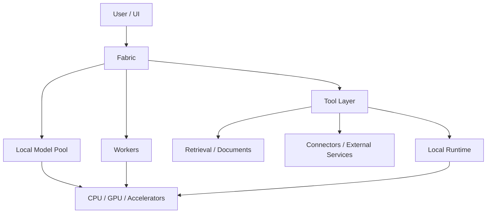

# Architecture Overview

This is the maximum intended architectural disclosure level for the public showcase.

## Public interface-level description

- **User / UI:** initiates tasks and receives results.
- **Fabric:** coordinates execution at a system level.
- **Local Model Pool:** provides model inference resources.
- **Workers:** execute bounded roles within larger workflows.
- **Tool Layer:** exposes permitted capabilities to the system.
- **Retrieval / Documents:** supplies knowledge and document-oriented operations.
- **Connectors / External Services:** integrates supported external systems where authorised.
- **Local Runtime:** executes local tools and processing workloads.
- **CPU / GPU / Accelerators:** provide heterogeneous compute resources.

## Explicitly out of scope for public architecture

The showcase does not document internal Fabric routing criteria, confidence thresholds, fallback rules, private orchestration state machines, system or worker prompts, private permission schemas, internal message schemas, production paths, hostnames, secrets or code-level call graphs for proprietary components.

The purpose is to explain **system shape and engineering intent**, not provide a reconstruction guide.
