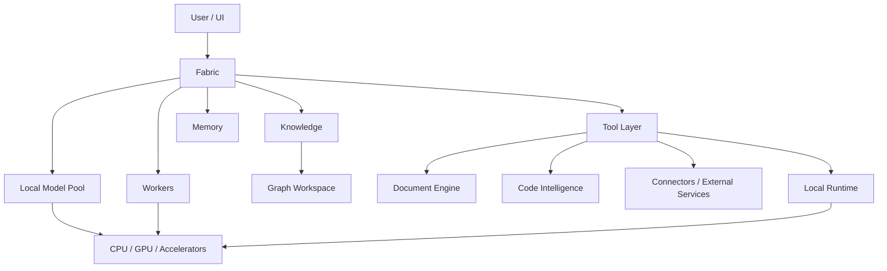

# Architecture Overview

This is the maximum intended architectural disclosure level for the public showcase. The diagram summarizes conceptual system relationships, not implementation topology. Ariamir is unfinished; the diagram does not certify integration completeness or production readiness.

## Public interface-level description

- **User / UI:** initiates tasks and receives results.
- **Fabric:** coordinates execution at a system level.
- **Local Model Pool:** provides model inference resources.
- **Workers:** execute bounded roles within larger workflows.
- **Tool Layer:** exposes permitted capabilities to the system.
- **Knowledge:** organizes and retrieves project knowledge, with reviewable learning proposals.
- **Graph Workspace:** provides visual exploration of relationships and optional cross-system views.
- **Memory:** supports conversational continuity and preferences separately from Knowledge.
- **Document Engine:** handles document analysis, generation and quality review.
- **Code Intelligence:** supports code exploration, diagnostics and reviewable changes.
- **Connectors / External Services:** integrates supported external systems where authorised.
- **Local Runtime:** executes local tools and processing workloads.
- **CPU / GPU / Accelerators:** provide heterogeneous compute resources.

Tool Lab and modules extend capabilities; Bridge / MCP and configured connectors expose supported integrations. Projects, tasks, artifacts and the desktop application provide the surrounding workspace. The [system catalog](capabilities.md) also covers diagnostics, distribution, local media and exploratory platform work.

## Explicitly out of scope for public architecture

The showcase does not document internal Fabric routing criteria, confidence thresholds, fallback rules, private orchestration state machines, system or worker prompts, private permission schemas, internal message schemas, production paths, hostnames, secrets or code-level call graphs for proprietary components.

The purpose is to explain **system shape and engineering intent**, not provide a reconstruction guide.
